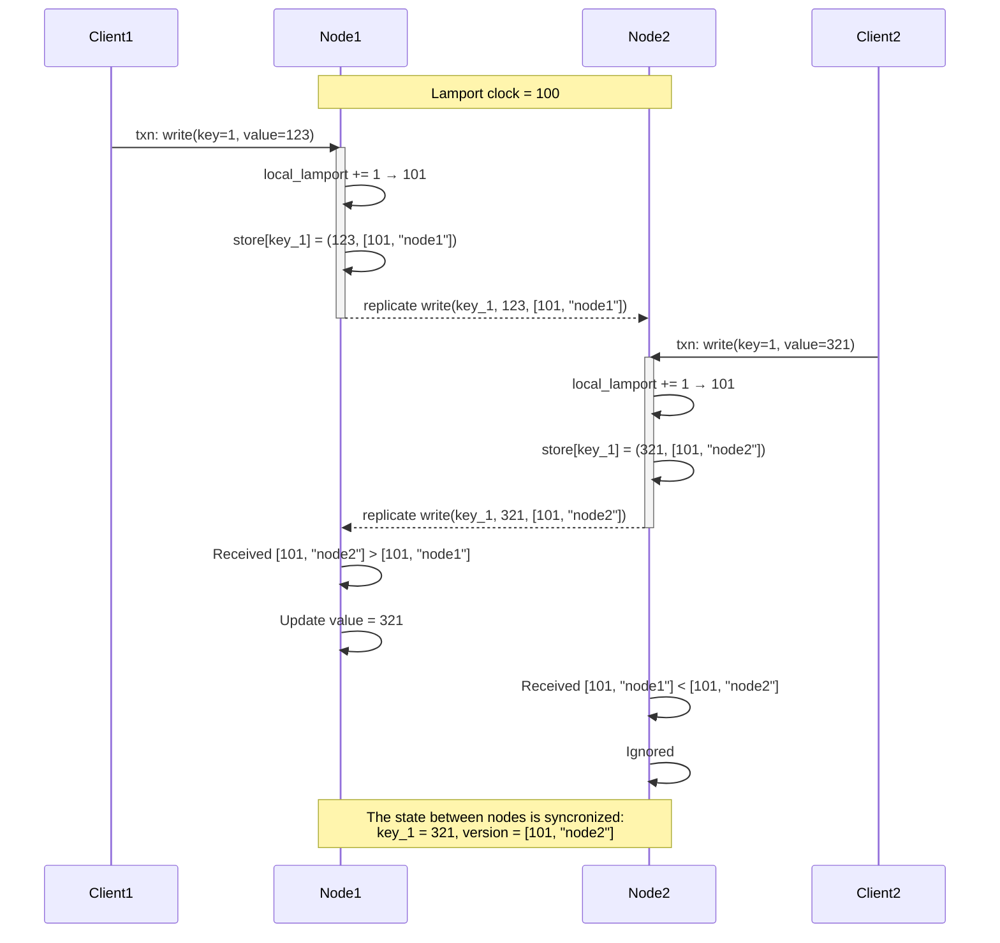

# dist-sys

My solutions to [Gossip Glomers](https://fly.io/dist-sys/) a series of distributed challenges.

## Challenges

## 1. Echo

[solution](./ch1-echo/main.go)

## 2. Unique ID


[solution](./ch2-unique-id/main.go)

Used combinations of unique string + node id.

## 3. Broadcast

### 3a. Single node implementation, no broadcasting
[solution](./ch3a-broadcast/main.go)

### 3b. Multiple nodes, broadcasting

[solution](./ch3b-broadcast/main.go)

Used gossip-style broadcasting: each node forwards a message to its neighbors. To prevent infinitive loops, we keep track of the messages we've seen.

### 3c. Fault tolerant broadcasting

[solution](./ch3c-broadcast/main.go)

In this implementation, I kept the same approach as in 3b, but additionally, I added a periodic syncronization between nodes (every second is enough to pass tests). This way, if a node goes down, it can eventually recover its state from its neighbors.

### 3d. Efficient Broadcast Part 1/2

[solution](./ch3d-broadcast/main.go)

In this implementation, I decided to ignore the default topology offered by maelstrom, instead, a node that receives
initial "broadcast" message becomes "primary", meaning it will be the one responsible for broadcasting messages to the rest of the nodes. In this case, the "primary" node becomes a single point of failure, if it goes down before the rest of the nodes have received the message, the message will be lost. To mitigate this, I added a random "backup" node, that is choosen every time a new "broadcast" message is received.
For the sake of simplicity, the "backup" node just forwards the same message to the rest of the nodes, but it could be further improved, for example, the backup node can wait for some period of time before broadcasting and/or then check N random nodes with "read" call, in order to confirm that the message was already received.

Other minor improvements:
- Changed the interval of the periodic state syncronization between nodes to 3 seconds to reduce the number of messages sent
- Use `SyncRPC` instead of `Send` to make syncronization more reliable

This solution also satisfies the requirements of the next challange `3e`, here's the final metrics:
```
:servers {:send-count 24672,
          :recv-count 24672,
          :msg-count 24672,
          :msgs-per-op 14.729552},

:stable-latencies {0 0, 0.5 78, 0.95 97, 0.99 99, 1 102},
```

Possible further improvements:
- Change the number of nodes we sync state with to reduce the network load (e.g. sync with only log(N)/sqrt(N) random nodes)
- Implement a more sophisticated backup node that can confirm that the message was received by the rest of the nodes

## 4. Grow-Only Counter

[solution](./ch4-counter/main.go)

Implemented a simplified version of the [CRDT](https://en.wikipedia.org/wiki/Conflict-free_replicated_data_type) G-Counter, where each node writes its changes in a separate key, e.g., `counter_<node-id>`. This way, we don't have any concurrency issues that would be present if we used a single key for all nodes. Additionally, each node periodically shares its state with the rest of the nodes, so they can merge the changes during a `read` request.

## 5. Kafka-Style Log

### 5a. Single-Node Kafka Style Log

[solution](./ch5a-kafka/main.go)

Nothing special here, just a simple implementation of a log, where each message has an offset (index slice).

### 5b. Multi-Node Kafka Style Log

[solution](./ch5b-kafka/main.go)

My initial thought was to store everything to the linearizable storage (this approach passes the tests though), but in real-world it would be too slow due to constant syncronization between nodes. Moreover, the task definition contains a hint that we should reason about where to use "linearizable" and where "sequential" storage.
So, I decided to use linearizable storage only for the metadata (last commited offset and last used offset) as it must be 
consistent across all nodes right away. For the log itself, I used a sequential storage as we can afford eventual consistency here.

Keys structure:
```
log:<id>:<offset> -> <message>
log:<id>:offset -> <last-used-offset>
log:<id>:last_commited_offset -> <last-commited-offset>
```

Results:
```
 :availability {:valid? true, :ok-fraction 0.9995144},
 :net {:all {:send-count 249732,
             :recv-count 249732,
             :msg-count 249732,
             :msgs-per-op 15.158239},
       :clients {:send-count 40758,
                 :recv-count 40758,
                 :msg-count 40758},
       :servers {:send-count 208974,
                 :recv-count 208974,
                 :msg-count 208974,
                 :msgs-per-op 12.68431},
       :valid? true},
 :workload {:valid? true,
            :worst-realtime-lag {:time 15.640901667,
                                 :process 8,
                                 :key "309",
                                 :lag 0.006614833},
            :bad-error-types (),
            :error-types (),
            :info-txn-causes ()},
 :valid? true}
```

### 5c. Efficient Kafka-Style Log

[solution](./ch5c-kafka/main.go)

In this implementation, I decided to improve reads by keeping {offset, message} pairs in a single key, e.g., `log:<id>`.
Doing so, we don't need to maintain a separate key for latest offset. `poll` handler becomes more efficient, as we don't have to do N separate calls to fetch all messages.

Final results:
```
 :availability {:valid? true, :ok-fraction 0.999457},
 :net {:all {:send-count 127966,
             :recv-count 127966,
             :msg-count 127966,
             :msgs-per-op 7.720888},
       :clients {:send-count 41014,
                 :recv-count 41014,
                 :msg-count 41014},
       :servers {:send-count 86952,
                 :recv-count 86952,
                 :msg-count 86952,
                 :msgs-per-op 5.2462893},
       :valid? true},
 :workload {:valid? true,
            :worst-realtime-lag {:time 0.0173055,
                                 :process 0,
                                 :key "9",
                                 :lag 0.0},
            :bad-error-types (),
            :error-types (),
            :info-txn-causes ()},
 :valid? true}
 ```

As an idea to get rid of CAS operations in `send` handler:
- choose a "key leader" by hashing the key, so only one node would be responsible for writing to the key
- in case a request is sent to a non-leader node - forward it to the leader

## 6. Totally-Available Transactions

### 6a. Single-Node Transactions

[solution](./ch6a-tx/main.go)

Simple single-node implementation, no persistence.

### 6b. Multi-Node Transactions

[solution](./ch6b-tx/main.go)

In this part, we have to support "Read Uncommited" consistency model, which means that we can basically return any state available at the moment of the read, even if some of the transactions are not yet commited.
To achieve this, I kept the same approach as in the previous part, but also added a versioning mechanism for the keys via [Lamport Clock](https://martinfowler.com/articles/patterns-of-distributed-systems/lamport-clock.html).

Each time we handle a write, we increment the local lamport clock and associate it with the key. When we replicate the change to the rest of the nodes, we only apply the change if either:
- the key doesn't exist on the node
- the local version of the key is less than the version of the key we're trying to write

To guarantee a deterministic order of the operations, we also consider the node id in the comparison (node id is used as a tie-breaker in case of equal versions), see the sequence diagram below.



### 6c. Totally-Available, Read Committed Transactions

[solution](./ch6c-tx/main.go)

The purpose of this challange is to support a "Read Commited" consistency model, which means that
we can only see the changes that have been commited. I decided to make it a bit more "strict" so we can avoid
non-repeatable reads anomaly. I took similar approach as it's implemented in PostgreSQL repeatable read (aka snapshotisolation) isolation level.
Every time we handle a transaction:
- we take a snapshot of the current state
- handle tx instructions using the snapshot and store the changes locally
- once the transaction is done, we apply the changes and replicate them to the rest of the nodes
